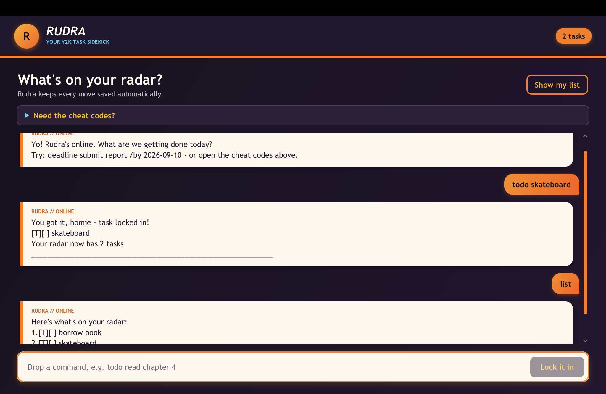

# Rudra User Guide

Rudra is your upbeat Y2K task sidekick. It keeps track of todos, deadlines, and events through short chat commands,
while saving your tasks automatically between sessions.



## Quick start

1. Ensure that Java 25 is installed.
2. Open a terminal in the project folder.
3. Run `./gradlew run`.
4. Enter a command in the chat field and press **Enter** or select **Lock it in**.

Open **Need the cheat codes?** inside Rudra for a quick reminder of the available commands. Enter `bye` when you
want to end the conversation.

## Command summary

| Action | Command format | Example |
| --- | --- | --- |
| Add a todo | `todo DESCRIPTION` | `todo borrow book` |
| Add a deadline | `deadline DESCRIPTION /by DATE [TIME]` | `deadline submit report /by 2026-09-20 2359` |
| Add an event | `event DESCRIPTION /from DATE TIME /to DATE TIME` | `event team meeting /from 2026-09-20 1400 /to 2026-09-20 1600` |
| Show all tasks | `list` | `list` |
| Mark a task done | `mark NUMBER` | `mark 1` |
| Mark a task not done | `unmark NUMBER` | `unmark 1` |
| Delete a task | `delete NUMBER` | `delete 2` |
| Find tasks | `find KEYWORD` | `find report` |
| Sort deadlines | `sort deadline` | `sort deadline` |
| Exit Rudra | `bye` | `bye` |

Task numbers come from the numbered output produced by `list`, `find`, or `sort deadline`.

## Adding tasks

### Todo

Use a todo for a task without a specific date:

```text
todo read chapter 4
```

### Deadline

Use a deadline for a task that must be completed by a particular date. The time is optional:

```text
deadline submit report /by 2026-09-20
deadline submit report /by 2026-09-20 2359
```

### Event

Use an event for an activity with a start and end time:

```text
event team meeting /from 2026-09-20 1400 /to 2026-09-20 1600
```

Dates use `YYYY-MM-DD`. Times use the 24-hour `HHmm` format, such as `0900` or `1430`.

## Viewing and updating tasks

Show the complete task list:

```text
list
```

Use the displayed task number to mark, unmark, or delete a task:

```text
mark 1
unmark 1
delete 2
```

Marking a task changes its status to `[X]`. Unmarking it changes the status back to `[ ]`.

## Finding tasks

Search task descriptions using a keyword:

```text
find report
```

The search ignores letter case, so `find REPORT` also finds tasks containing `report`.

## Sorting deadlines

Move deadlines to the top of the list and arrange them from earliest to latest:

```text
sort deadline
```

Deadlines with the same date and time keep their existing order. Todos and events also keep their existing order.
The displayed order is saved and determines the task numbers used by later commands.

## Saving and error recovery

Rudra saves changes automatically in `data/rudra.txt`.

- If the file does not exist, Rudra starts with an empty list and creates it when the first task is saved.
- If a command is incomplete or invalid, Rudra explains the problem and waits for another command.
- If a saved record is corrupted, Rudra skips it, loads the valid records, and displays a warning.
- If saving fails, Rudra rolls back the attempted change so the task list remains consistent with the saved data.

You normally do not need to edit the data file yourself.
